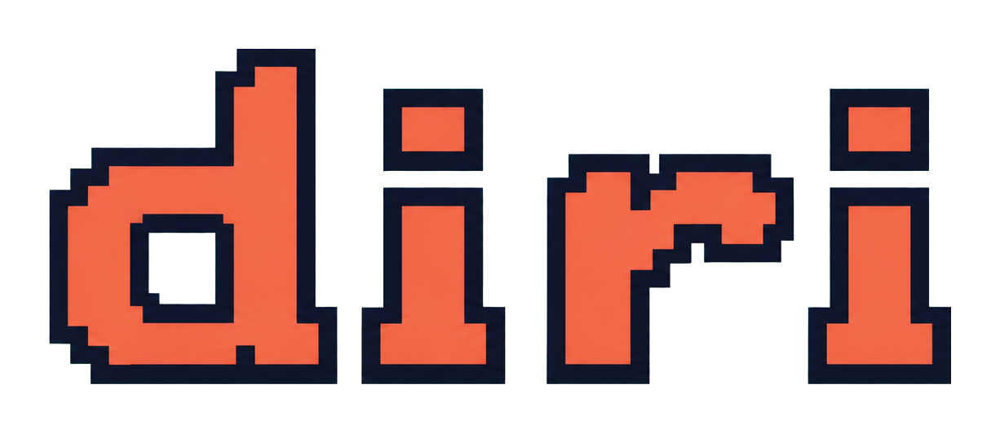
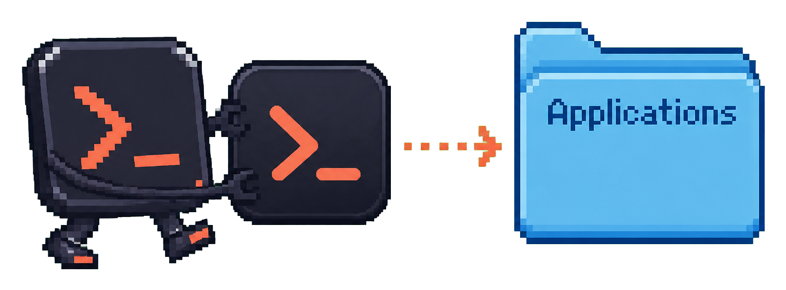
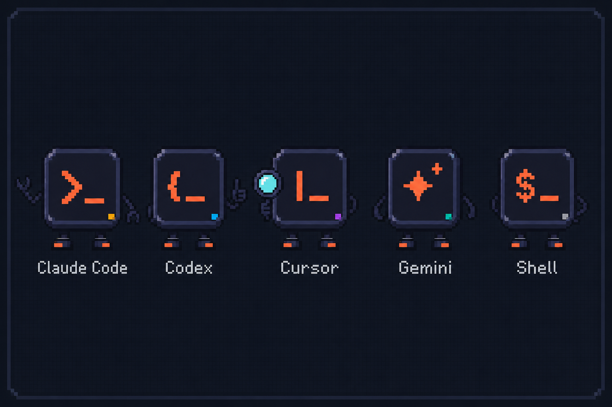
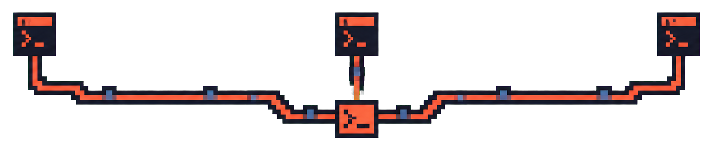
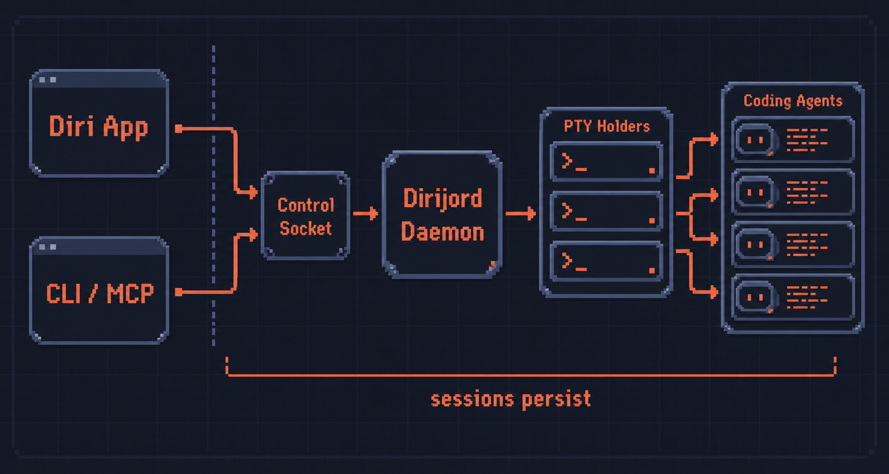

<h1></h1>

[](https://github.com/cristicretu/diri/actions/workflows/ci.yml)
[](LICENSE)
[](https://github.com/cristicretu/diri/releases/latest)

Run coding agents in parallel without babysitting a wall of terminals.

diri is a native workspace for Claude Code, Codex, Cursor, Gemini, and other
terminal agents on macOS and Linux. See which sessions are working, waiting, or
done; isolate parallel work in git worktrees; review changes; and reconnect
after closing the app.

No Diri account or hosted relay. Your sessions run on your computer or an SSH
host you control.


<p align="center"></p>

## Install

### macOS

```sh
brew install --cask cristicretu/diri/diri
```

Or download the latest DMG from [Releases](https://github.com/cristicretu/diri/releases/latest),
open it, and drag diri to Applications. Both routes install the same universal
build for Apple silicon and Intel, signed and notarized. diri handles updates
from there.

<p align="center"></p>

The Homebrew cask lives in the
[cristicretu/diri](https://github.com/cristicretu/homebrew-diri) tap, so the full
cask name is required. macOS 15 or newer.

### Linux beta

Download the x86_64 AppImage or Debian package from
[Releases](https://github.com/cristicretu/diri/releases/latest). Ubuntu 22.04
and 24.04 are supported under X11 and Wayland with a Vulkan 1.3-capable GPU.

```sh
sudo apt install ./diri_<version>_amd64.deb
# or
chmod +x diri_<version>_amd64.AppImage && ./diri_<version>_amd64.AppImage
```

See the [Linux beta guide](diri/LINUX.md) for checksums, upgrades, XDG paths,
graphics troubleshooting, and current limitations.

## Why use diri

- **Know where you are needed.** Live status separates agents that are working,
  waiting for input, or done. Notifications and the sidebar let you follow many
  sessions without reading every terminal.
- **Keep sessions alive.** A dedicated Holder owns each PTY. Closing diri does
  not stop local work, and the Engine can restart and adopt the same running
  sessions.
- **Give parallel work room to breathe.** Create isolated git worktrees, keep
  their lineage visible, and hand work from one agent to another.
- **Review the result in one place.** Inspect diffs, stage or discard changes,
  commit work, and follow pull request checks and discussion beside the session
  that produced it.
- **Use the tools you already chose.** diri ships 22 agent definitions and runs
  each installed CLI in a real terminal under your user account. Claude Code
  and Codex have the deepest status detection and resume support; other agents
  remain fully usable as terminals even when their integration is lighter.
- **Work on an SSH host directly.** diri verifies and bootstraps a small matching
  Helper, then gives each remote session its own PTY Holder. It needs no `tmux`,
  preinstalled Diri service, `sudo`, or hosted relay.
- **Let agents coordinate when you want them to.** The included MCP server lets
  an agent start another session, inspect its progress, read its output, and
  answer prompts.



## 60-second tour

1. Add a project directory and create a session for an installed agent or a
   plain shell.
2. Start parallel sessions in separate worktrees when they may edit the same
   repository.
3. Follow live status in the sidebar. Open a session when it needs you or when
   its changes are ready to review.
4. Quit and reopen diri. Your local sessions and terminal history are still
   there.

The [getting-started guide](docs/GETTING_STARTED.md) covers remote hosts, MCP
orchestration, diagnostics, local data, and uninstalling.

<p align="center"></p>

## From your iPhone

The companion iPhone beta can start sessions, send prompts, answer agent
questions, follow output, and review tracked changes. It connects to the Mac
app through your Tailscale network; Diri does not proxy session content through
a hosted service. See the [iPhone setup and build guide](ios/README.md).

## Architecture

The desktop app and CLI connect to one local Rust Engine:



- **`diri`** is the desktop app, built with Rust and
  [GPUI](https://github.com/zed-industries/zed). It owns the window, sidebar,
  terminal renderer, command palette, and usage views.
- **`dirijord-rs`** is the headless local Engine. It owns session records,
  orchestration, worktrees, status reduction, terminal history, and the control
  socket.
- **`diri-holder`** owns a local session's PTY and agent process tree so the
  Engine can restart without ending the work.
- **`diri-remote`** is the bootstrapped remote Helper. One independent Holder
  owns each remote PTY while SSH carries the encrypted protocol connection.

`dirijor` is the automation CLI for hooks, notifications, status, and
diagnostics. `dirijor-mcp` is the MCP stdio server injected into agents. Every
shipped executable is built from the Rust workspace in [`diri/`](diri/).

## Adding an agent

Agent support is data. Each JSON file in
`diri/crates/diri-engine/manifests/` describes how to start and resume an agent,
which keys approve or deny a prompt, and the screen rules that determine its
status. Copy the closest manifest and adjust it; no Rust changes are required.
The [manifest-authoring guide](docs/AGENT-MANIFESTS.md) explains the schema,
capture workflow, examples, overrides, and validation.

## Building from source

The Rust toolchain is pinned in `diri/rust-toolchain.toml`. macOS builds require
the Xcode command-line tools. Linux dependencies and packaging commands are in
the [Linux beta guide](diri/LINUX.md). The first build compiles GPUI from a
pinned Zed revision and takes a while.

```sh
(cd diri && cargo build)                   # app, engine, holders, CLI, MCP
(cd diri && cargo test --workspace)
(cd diri && cargo run -p diri-app)         # run the app from source

diri/scripts/package.sh                    # full macOS bundle
diri/scripts/package-linux.sh              # AppImage + DEB, on x86_64 Linux
diri/scripts/install-local.sh
```

Run the same core checks as CI with one command:

```sh
./scripts/check.sh
```

[`diri/PACKAGING.md`](diri/PACKAGING.md) covers signing and notarization,
[`diri/UPDATING.md`](diri/UPDATING.md) covers updates and releases, and
[`diri/NODE.md`](diri/NODE.md) covers the optional enhanced remote-node mode.
The [documentation index](docs/README.md) links the remaining user and
engineering guides.

## Contributing

See [CONTRIBUTING.md](CONTRIBUTING.md). Bug reports, fixes, docs, and new agent
manifests are welcome. New contributors can start with
[`good first issue`](https://github.com/cristicretu/diri/labels/good%20first%20issue)
or [`help wanted`](https://github.com/cristicretu/diri/labels/help%20wanted).

Questions belong in [Discussions](https://github.com/cristicretu/diri/discussions),
reproducible bugs in [Issues](https://github.com/cristicretu/diri/issues), and
vulnerabilities in [private security reports](SECURITY.md). See the
[roadmap](ROADMAP.md), [support guide](SUPPORT.md), [privacy notice](PRIVACY.md),
and [governance](GOVERNANCE.md) for project expectations.

## License

Diri's original source is Apache 2.0. Builds also contain third-party software
under its own licenses; see [LICENSE](LICENSE), [NOTICE](NOTICE), and the
machine-checked dependency policy in [`license-policy.json`](license-policy.json).
