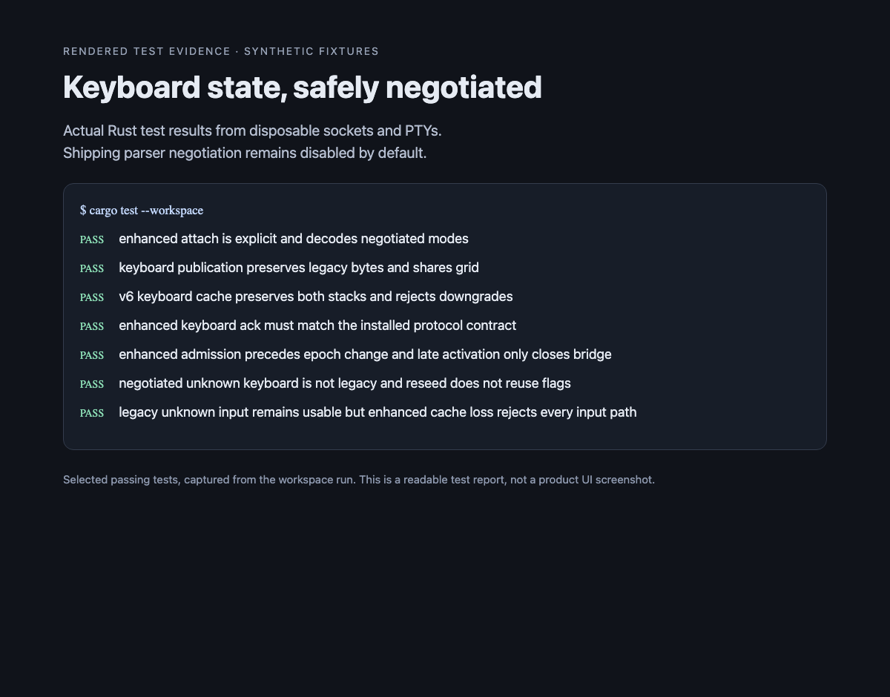

# Enhanced keyboard state compatibility

This change prepares the parser, mode transport and cache path. **Shipping
parser negotiation stays disabled.** Native event encoding and release lifecycle
must be integrated before enabling it for product sessions.

## Compatibility

| Owner / state | Input behavior |
| --- | --- |
| Verified supported pre-14 remote Holder | Existing legacy behavior; pre-9 modes remain unknown |
| Known legacy cursor/keypad projection | Legacy encoder remains usable |
| Known enhanced flags, including zero | Flags are available to explicitly opted-in clients |
| Enhanced-capable owner with missing/restoring state | Typed, raw, paste and submit input fail closed |
| Enhanced remote owner before validated seed or during reconnect | Input remains unavailable; last grid stays visible |

An incapable controller is rejected before wake/visibility or controller-epoch
changes when enhanced flags are active. If flags activate after admission, only
that controller is disconnected. The Holder and Agent remain alive. Read-only
previews retain the legacy mode format and never receive input authority.

`AttachmentOptions { enhanced_keyboard: true, ..Default::default() }` opts the
local controller into the versioned mode tail. Remote minor 14 additionally
requires explicit `enhanced-keyboard-v1` negotiation. Old wire shapes are kept
byte-for-byte/object-for-object; unknown enhanced state is not converted to zero.

## Parser and recovery

Direct mode set, query, push/pop and alternate-screen transitions use the same
parser state. This fixes a reproduced query returning zero immediately after
setting flags to five. See the [keyboard protocol](https://sw.kovidgoyal.net/kitty/keyboard-protocol/).

Visible cache v6 preserves both bounded keyboard stacks, current flags and known
state. The encoded projection is at most 8,198 bytes (4,096 entries per screen),
validated before stack allocation. Nonzero enhanced state cannot enable a
disabled parser. Older or incomplete caches remain explicitly unknown; a valid
full keyboard snapshot is required to establish knowledge again.

The process-local exact snapshot integration must also preserve
`keyboard_enhancements_known` beside existing exact Term flags/stacks. The
visible-cache extension does not replace complete parser durability.

## Verification

Tests include all 32 flag combinations, invalid bits/lengths, full stack limits,
old payload preservation, explicit opt-in, sequence-bound publication/reseed,
mode-only deltas, actual authenticated Holder admission, unchanged live PID after
an incompatible bridge closes, lost-state input rejection and cache restore.

The image is a readable capture of actual selected test results, not a product
UI screenshot. Reproduce with workspace tests and the vendored parser suite
using the workspace's local VTE patch.
