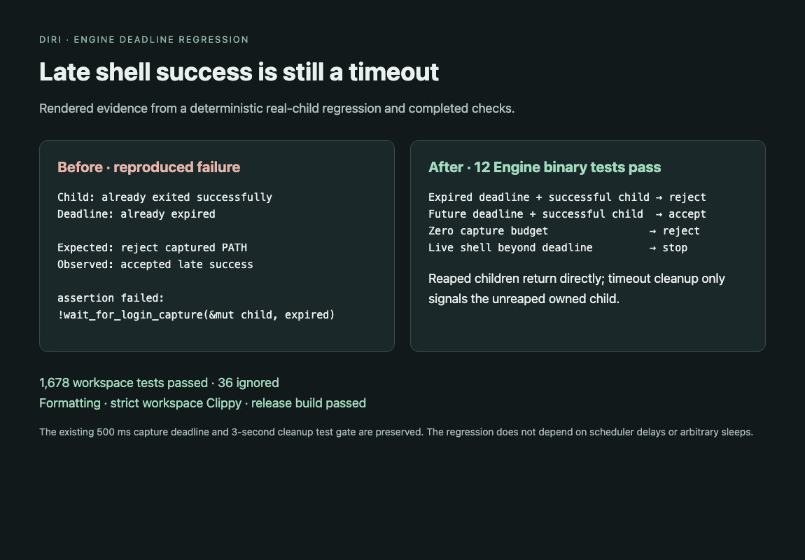

# Login-path capture deadline

The Engine rejects shell PATH output when it observes successful exit after the capture deadline. Previously, successful `try_wait` won before the deadline check, so a delayed owner could accept late output.

The deadline starts before capture/spawn work. Each wait is bounded by the remaining time. Already-reaped children return directly; cleanup signals only the still-owned unreaped child and its process group. The existing inherited-PATH fallback and anonymous output capture remain in place.

A deterministic regression reaps a successful real child, then presents an expired deadline; it failed before the fix and passes afterward. Tests also cover a future deadline, zero budget, live-shell timeout cleanup, and inherited stdout. The existing 500 ms timeout fixture and 3-second cleanup gate are unchanged.

Validation: 12 Engine binary tests and 1,678 workspace tests passed (36 ignored); formatting, strict workspace Clippy and release build passed.

