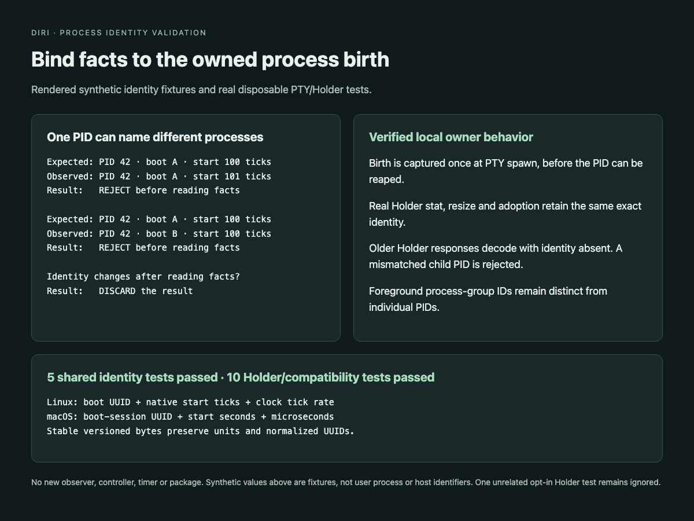

# Owned process birth identity

`diri_proto::process::ProcessIdentity` identifies a PID in its execution host's PID namespace with platform-native birth units. Linux records its boot UUID, `/proc/PID/stat` start ticks and `_SC_CLK_TCK` rate. macOS records `kern.bootsessionuuid` and libproc's full start seconds/microseconds. UUID text normalizes to the same 16 bytes; no rounded seconds or wall-clock conversions are used.

`Pty::spawn` captures the value while it exclusively owns the unreaped child. `Pty::child_identity()` returns that immutable captured value, which is not a liveness assertion. `diri_pty::process_identity::inspect_verified` checks the expected identity before and after a bounded fact read on the same host. A changed or unavailable identity discards the result.

Local Holder `stat` adds optional `childIdentity`. Its owner brackets the existing stat facts with those checks. Consumers use `HolderStat::verified_child_identity()`, which also rejects inconsistent `childPID` fields. Old Holders omit the identity; identity-backed recovery or inspection must remain unavailable rather than learning a replacement birth from a numeric PID. The historical `foregroundPID` wire field names a foreground process **group**.

## Stable identity bytes

`canonical_bytes()` uses this immutable version-1 format:

1. ASCII `diri-process-identity`, NUL, version byte `1`.
2. PID as a four-byte big-endian unsigned integer.
3. Platform byte: Linux `1`, macOS `2`.
4. Sixteen normalized boot UUID bytes.
5. Eight-byte big-endian start ticks or start seconds.
6. Four-byte big-endian clock ticks per second or start microseconds.

Durable consumers bind these bytes together with their session/epoch identity. They must not use identity as authorization to inspect or signal arbitrary processes. Remote identity projection and process-detail APIs are separate capability-gated work; remote PIDs must never be inspected on the local host.

The platform definitions follow the [Linux proc documentation](https://docs.kernel.org/filesystems/proc.html) and [Apple's boot-session sysctl definition](https://github.com/apple-oss-distributions/xnu/blob/main/bsd/kern/kern_sysctl.c).

## Validation

1,683 workspace tests passed; 36 ignored. Formatting, strict workspace Clippy and release build passed. Focused tests cover canonical bytes, native units, malformed identity, mocked PID reuse/boot changes, mismatches after fact reads, real owned-child exit, Holder resize/adoption and old Holder compatibility.

