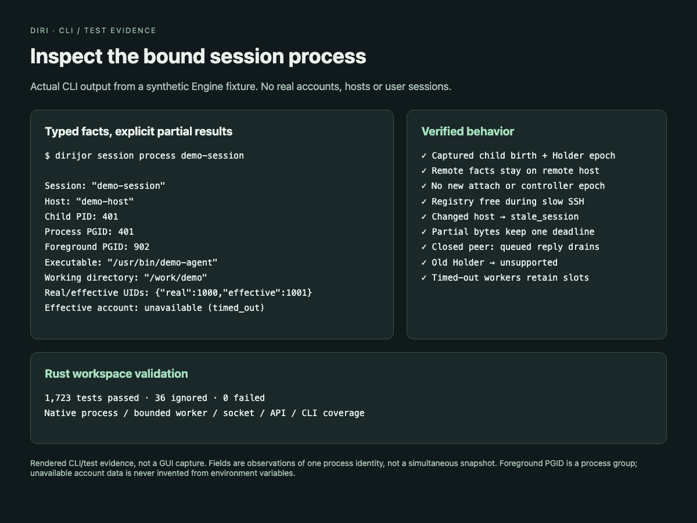

# Session process facts

`dirijor session process SESSION_ID` shows identity-verified observations of the
session's current child. Add `--json` for the typed response. The corresponding
Rust client operation is `Client::process_info`; the control method is
`session.process_info` with `{"sessionID":"..."}`.

The response includes the session and host, observation time, captured child
birth identity, executable path, current working directory, real/effective UIDs,
effective account name/home, own process-group ID and foreground process-group
ID. It does not read command arguments or environment variables.

Each field is either `{"status":"available","value":...}` or
`{"status":"unavailable","reason":"..."}`. Reasons include unsupported,
permission denied, not found, invalid data, timeout and busy. An available null
foreground PGID means the kernel reports no controlling foreground group. A
foreground PGID is never presented as the PID of an individual process.

Account lookup failure leaves the other identity-verified observations usable.
If the child identity, session binding or overall deadline changes, the entire
operation fails. These are observations of one process identity, not an atomic
snapshot: a live process can change executable, cwd or UID between reads.

## Ownership and bounds

- Capture the Engine session handle under Registry, then release Registry for
  all native, socket, account and SSH work. Recheck the handle and host before
  returning. Inspection does not update activity, wake a parser or take control.
- A local Holder session retains the child's captured birth and log epoch from
  launch/adoption. Stat replies before and after native inspection must match
  that binding. Missing identity from an older Holder is unsupported.
- Remote minor 13 adds `process-facts-v1` to Helper capabilities and optional
  fields on authenticated `inspect`. The Helper performs native observations on
  the remote host between matching birth, state, incarnation and ownership
  checks. It opens no Holder attach connection and does not advance its epoch.
- One one-second Engine deadline covers every phase. The account phase is capped
  at 250 ms. Four inspections may run concurrently. Local stat replies are
  limited to 16 KiB; partial reads do not extend the deadline.
- Potentially blocking account databases run in a one-shot mode of the existing
  Rust Helper binary. The child has a cleared environment, bounded 8 KiB stdout,
  a deadline, and an admission permit retained until actual reap. Killed workers
  that are not yet reapable transfer to bounded on-demand cleanup. If a reaper
  thread cannot start, the child and permit stay in a tracked queue for the next
  request; the caller does not block on cleanup. These are per-caller-process
  limits, not a host-wide process cap. The worker directly execs the Rust binary
  without a shell, and never runs in a terminal owner loop.

Linux reads bounded `/proc` fields; macOS uses native `proc_pidpath` and
`proc_pidinfo`. UID ordering follows [Linux proc_pid_status](https://www.man7.org/linux/man-pages/man5/proc_pid_status.5.html).
The foreground value is the process-group field described by
[Linux proc_pid_stat](https://www.man7.org/linux/man-pages/man5/proc_pid_stat.5.html)
and [Apple proc_info definitions](https://github.com/apple/darwin-xnu/blob/main/bsd/sys/proc_info.h).

## Validation

Tests cover changed child birth during a read, replacement Holder epochs,
missing old-Holder identity, remote-only facts, unchanged controller epoch,
Registry availability during slow SSH, host changes during an in-flight read,
partial replies, immediate peer close with queued bytes, oversized replies,
account timeout/admission/UID validation, and CLI JSON/human output.

The screenshot is rendered CLI/test evidence from a synthetic Engine fixture;
it contains no real account, host or session data.

