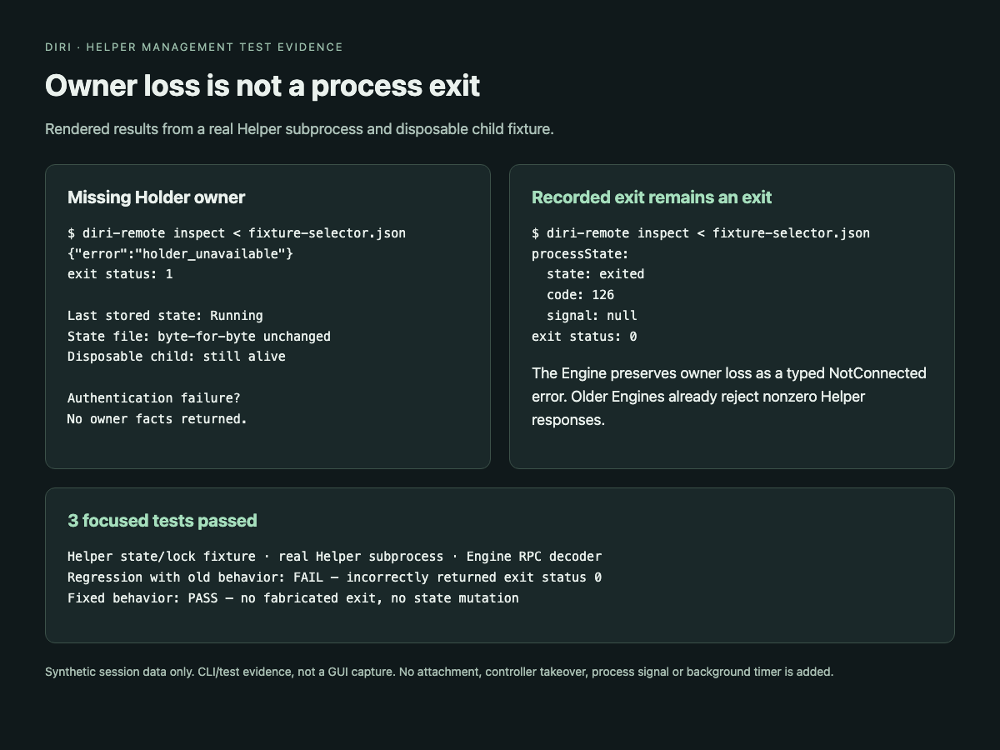

# Remote inspection after owner loss

A missing Holder lock establishes that the session has no current Holder owner.
It does not establish the Agent's exit status. `inspect` now leaves the last
persisted process fact untouched and returns a nonzero management response:

```json
{"error":"holder_unavailable"}
```

The Engine retains this as `io::ErrorKind::NotConnected` with a typed
`RemoteManagementFailure::HolderUnavailable` source. Successful inspection JSON
is unchanged. Older Engines already reject nonzero Helper commands; unknown or
truncated error bodies retain the existing generic failure behavior. This
additive failure response does not add a terminal frame or take a controller
lease.

Recorded exit facts, including exit code 126 and signal exits, remain successful
inspection results after the Holder disappears. Authentication and incarnation
validation run before owner facts are returned. This correction does not alter
`kill` semantics or claim to repair records previously overwritten by old code.

## Verification

- A real Helper subprocess inspects a synthetic session with a live disposable
  child and no Holder owner. It returns exit status 1 and the typed error, leaves
  the state file byte-identical, and leaves the child alive.
- The same fixture rejects invalid authentication without disclosing owner facts
  and preserves a recorded exit code 126.
- Helper unit coverage exercises held/missing locks, stale incarnations, and
  recorded normal/signal exits.
- Engine decoder coverage checks typed failure, older text-only failures,
  unknown future errors, and truncated responses.
- Reinstating the old implementation makes the subprocess regression fail:
  inspection incorrectly returns exit status 0.


