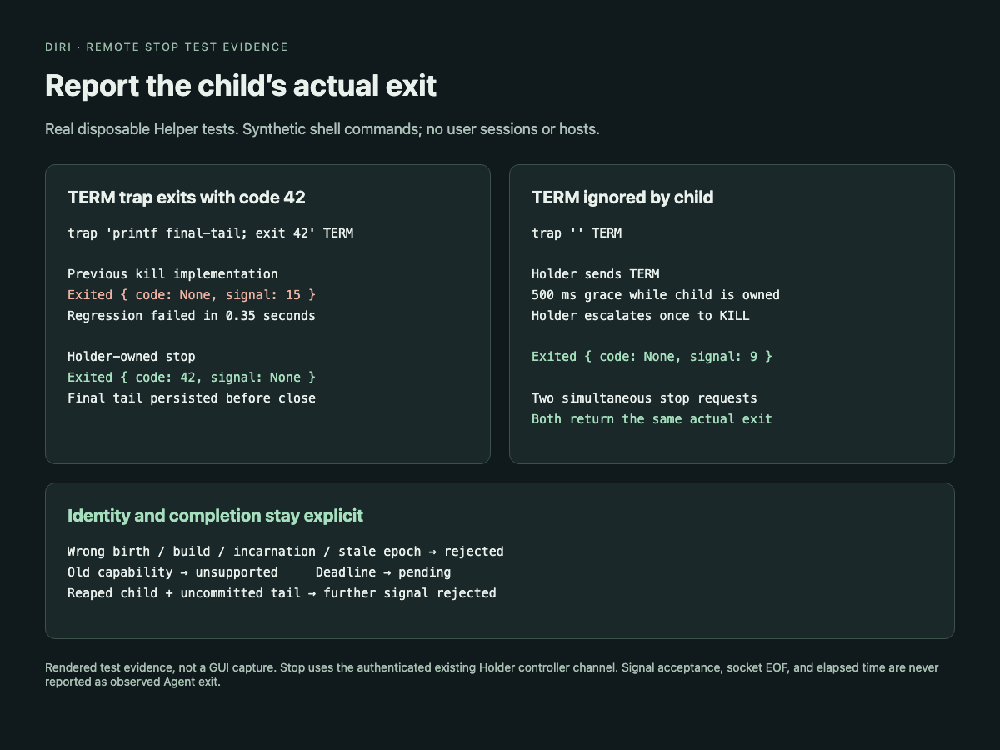

# Stop through the owning Holder

An Agent can trap TERM and exit with its own code. The old Helper management
command always wrote a synthetic TERM exit, even when the child actually exited
with code 42. It also signaled numeric process IDs outside the owning loop.

Protocol minor 12 adds `stop-session-v1` and `StopSession` (frame 47) to the
existing authenticated controller channel. The Holder validates the controller
epoch and signals only while its child remains unreaped. It sends TERM, allows
500 ms, then sends KILL once if still necessary. It drains PTY output, persists
the actual exit and tail, then releases ownership after a bounded final socket
flush. The grace timer exists only during an explicit stop.

The management command validates the stored native birth identity on the owning
host, releases the metadata lock before waiting, and checks the HelloAck build,
incarnation, birth and epoch before requesting stop. It then requires both
recorded exit facts and the same Holder's released ownership lock. Concurrent
requests join the same stop; a completed stop is idempotent. This destructive
operation can revoke a previous controller.

The five-second request deadline covers metadata lock acquisition, socket
admission, protocol waits and existing transient-supervisor cleanup. Unsupported
old Holders fail closed. Socket EOF, signal acceptance, missing ownership and a
request timeout never create an exit fact. No numeric PID fallback is used.
If final output cannot be drained or persisted, the command cannot claim a
completed stop; it returns a structured failure or pending result.

The Engine also consumes the returned exit directly. The stop controller can
revoke the previous attach before its exit event arrives; both Engine terminate
paths now publish the stop result instead of falling back to a synthetic KILL.
A cleanup failure preserves an exit only if that exit was already observed.
Old Helper protocols and mismatched or ambiguous stop responses are rejected.

## Verification

- The new TERM-trap regression fails against the old implementation: it reports
  signal 15 instead of exit code 42.
- Real disposable Helper tests cover trapped TERM, ignored TERM requiring KILL,
  simultaneous stop requests, final-tail persistence, repeat stop and GC.
- Owner-loop regression rejects stale epochs and old protocol requests without
  signaling, then rejects signals after reap while exit facts remain uncommitted.
- Unit tests reject wrong build/incarnation/birth, old capabilities, stale epochs,
  missing ownership and expired deadlines; a full socket backlog cannot block
  indefinitely. Native platforms may refuse a full backlog immediately.
- A real Helper over fake SSH reproduces the Engine's previous synthetic KILL
  fallback after controller revocation, then verifies exit code 42 reaches both
  the return value and shared session projection.
- The StopSession codec preserves its epoch at every byte split.

Final validation: `cargo fmt --all -- --check`, strict workspace Clippy,
1,699 workspace tests passed (36 intentionally ignored), and the workspace
release build passed on macOS arm64. Linux runtime and ordinary-user SSH soak
remain CI/opt-in gates; these local results do not claim those environments.
