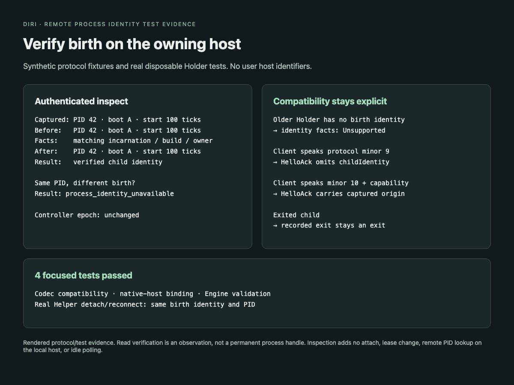

# Verified remote process birth identity

Protocol minor 10 adds the optional `process-identity-v1` capability. The Holder
captures `ProcessIdentity` from its owned PTY child before reaping is possible and
persists it in the existing schema-1 state file. The shared type records native
boot identity and process-start units; see [the shared format](process-birth-identity.md).

The existing HelloAck carries optional `childIdentity` to clients speaking minor
10 or later. This is captured origin metadata, not proof of current liveness.
The codec rejects a birth whose PID disagrees with a running child, or whose
protocol/capability does not support it. Older clients receive no birth field.

## Lease-free facts

`RemoteManager::inspect_process_identity` requires an expected incarnation and a
compatible Helper. It invokes existing authenticated `inspect`, which performs
native process observations on the owning host before and after reading the
facts. Inside that bracket, the Helper rechecks authentication, incarnation,
Holder build/PID, child identity/process state, and Holder ownership lock. The
Engine validates returned session/incarnation/build and child PID again.

A changed or unreadable birth returns the nonzero structured error
`process_identity_unavailable`; it never becomes an Agent exit. Missing birth in
old Holder state remains absent, and the stronger Engine method returns
Unsupported. Recorded exits remain ordinary inspection results; the identity
method reports the exited child as NotConnected. `list` supplies persisted facts
and deliberately omits a verified current identity.

No local lookup is performed for a remote PID, and no observer, attachment,
controller change, timer, or new terminal frame is introduced by inspection.
Foreground process-group identifiers are not treated as individual PIDs.

This read bracket does not provide a permanent kernel process handle. A later
signal must still go through the owning Holder with incarnation/controller and
unreaped-child checks; signal/kill changes are a separate follow-up.

## Verification

- Shared codec: old optional-field omission, capability/minor validation,
  mismatched child PID, binary frame round trip.
- Host fixture: matching native birth, changed start identity, changed durable
  incarnation/build/owner/child state, allowed output-sequence progress, old
  state omission, owner loss, and recorded exit preservation.
- Engine decoder: missing/old facts, wrong build/incarnation, conflicting PID,
  and actual exited state.
- Real Helper detach/reconnect preserves identical captured birth and process
  PID. Inspection leaves controller epoch unchanged; an older client receives
  no new birth field.
- Fake SSH exercises the Engine method against the actual disposable Helper.

