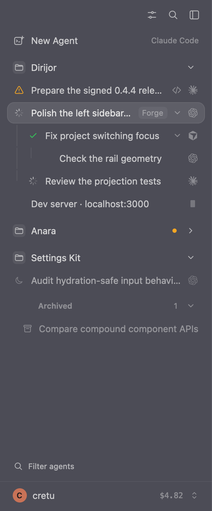
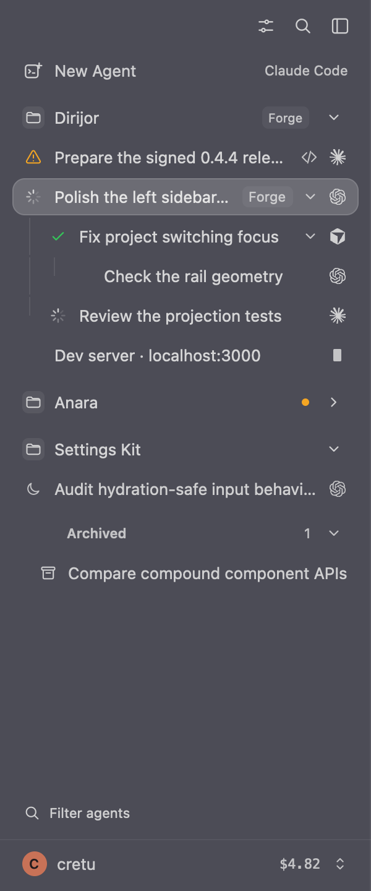
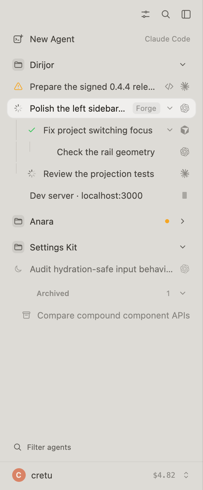
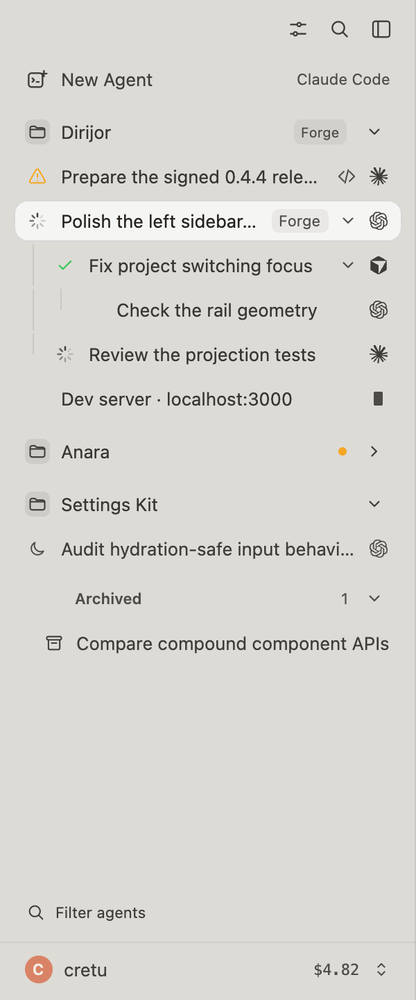

# Glass sidebar contrast

These are unedited 2× screenshots from the real GPUI sidebar renderer, using
sample sessions and identical fixed backdrops. They do not capture macOS's live
desktop blur. The fixture includes selected, working, idle, sleeping, archived,
and remote-host states.

The before images use main at `605bf979` with only this PR's screenshot-fixture
changes applied. The after images include the contrast changes.

From `diri/` on macOS:

```sh
DIRI_VISUAL_BACKDROP=62616e DIRI_VISUAL_WIDTH=300 DIRI_VISUAL_POPOVER=none \
  DIRI_VISUAL_OUTPUT=/tmp/sidebar-dark.png \
  cargo test -p diri-app render_sidebar_preview_screenshot -- --ignored --nocapture

DIRI_VISUAL_LIGHT=1 DIRI_VISUAL_BACKDROP=d4d2ce DIRI_VISUAL_WIDTH=300 \
  DIRI_VISUAL_POPOVER=none DIRI_VISUAL_OUTPUT=/tmp/sidebar-light.png \
  cargo test -p diri-app render_sidebar_preview_screenshot -- --ignored --nocapture
```

| Dark before | Dark after |
| --- | --- |
|  |  |

| Light before | Light after |
| --- | --- |
|  |  |
