# New Agent menu

Unedited 2× renders from the real GPUI sidebar, cropped to the menu. They use
the preview session fixture, a seeded agent catalog (Claude Code, Codex,
Cursor, OpenCode locally; Claude Code and Codex on the remote host) and a fixed
backdrop, so they do not show macOS's live desktop blur.

The before images use main at `a9b24f8a` with only this PR's screenshot-fixture
commit applied. The after images include the menu redesign.

From `diri/` on macOS:

```sh
# The menu with a remote host configured (dark / light).
DIRI_VISUAL_BACKDROP=62616e DIRI_VISUAL_WIDTH=300 DIRI_VISUAL_POPOVER=new-agent \
  DIRI_VISUAL_HOSTS=1 DIRI_VISUAL_OUTPUT=/tmp/new-agent-dark.png \
  cargo test -p diri-app render_sidebar_preview_screenshot -- --ignored --nocapture

DIRI_VISUAL_LIGHT=1 DIRI_VISUAL_BACKDROP=d4d2ce DIRI_VISUAL_WIDTH=300 \
  DIRI_VISUAL_POPOVER=new-agent DIRI_VISUAL_HOSTS=1 \
  DIRI_VISUAL_OUTPUT=/tmp/new-agent-light.png \
  cargo test -p diri-app render_sidebar_preview_screenshot -- --ignored --nocapture

# Variants: drop DIRI_VISUAL_HOSTS for a Mac with no hosts.json entries,
# add DIRI_VISUAL_HOST=forge to target the remote host, and set
# DIRI_VISUAL_NEW_AGENT=where (the machine + folder panel) or
# DIRI_VISUAL_NEW_AGENT=browse (the remote directory walk, best at
# DIRI_VISUAL_WIDTH=340 with DIRI_VISUAL_HOST=forge).
```

| Before | After |
| --- | --- |
| 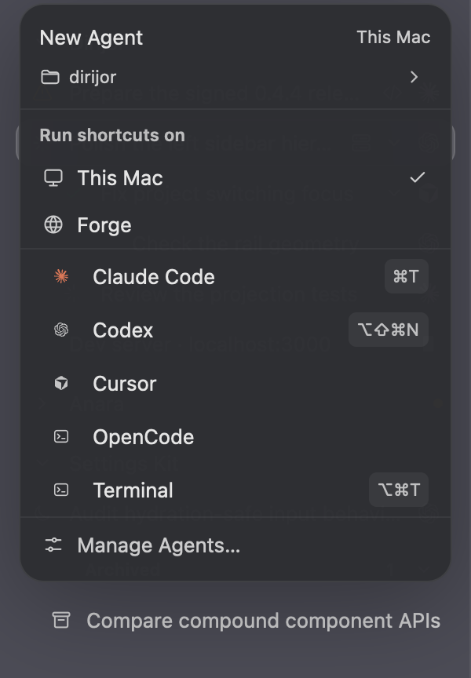 | 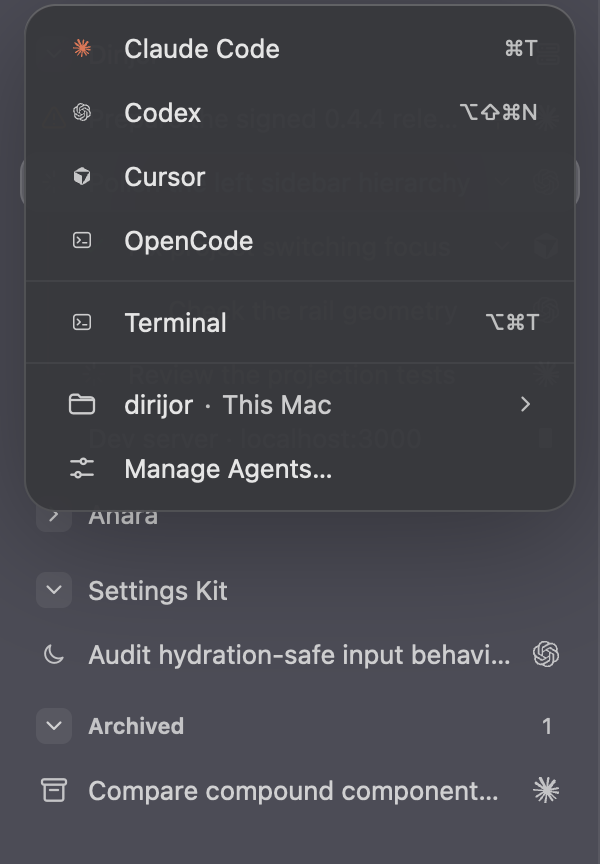 |

| No remote hosts, before | No remote hosts, after |
| --- | --- |
| 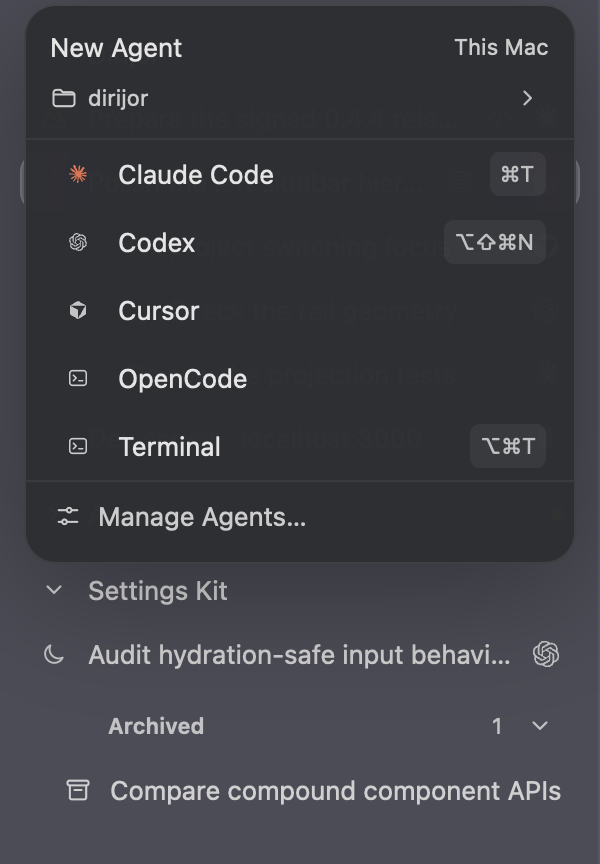 | 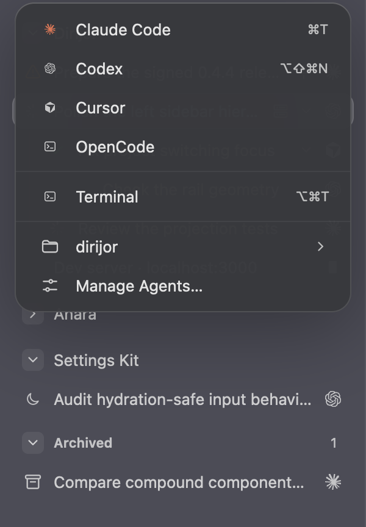 |

| Targeting Forge, before | Targeting Forge, after |
| --- | --- |
| 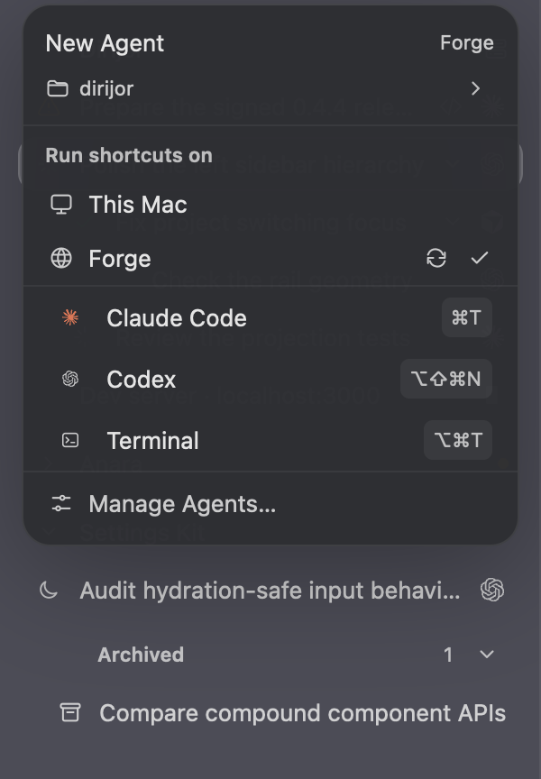 | 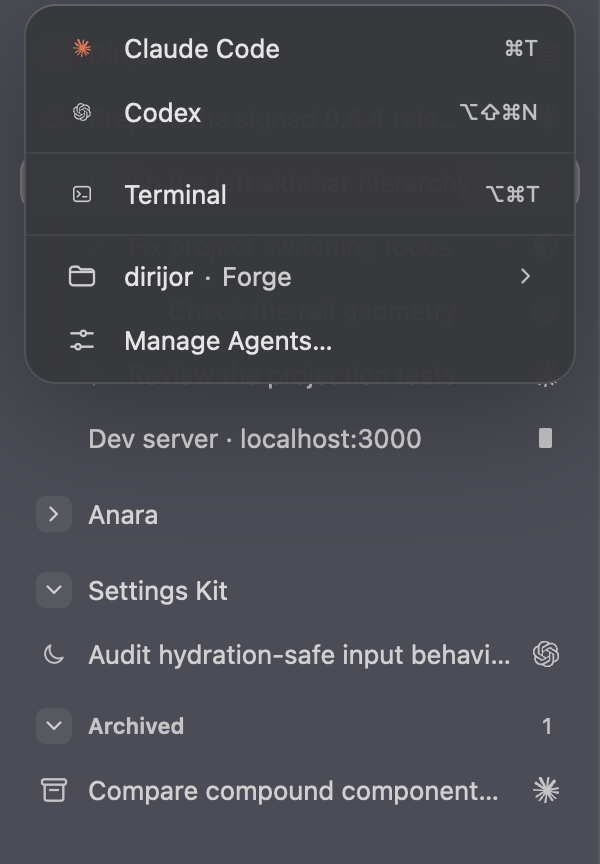 |

| Where panel, This Mac | Where panel, Forge | Remote folder walk |
| --- | --- | --- |
| 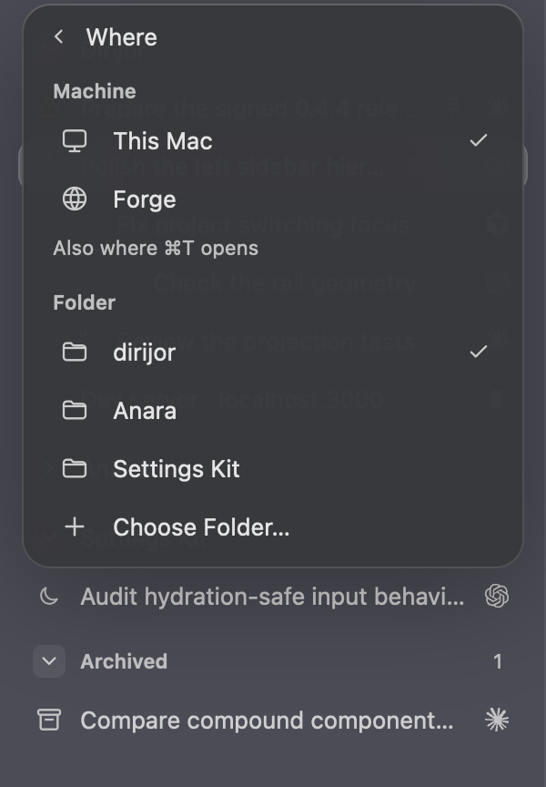 | 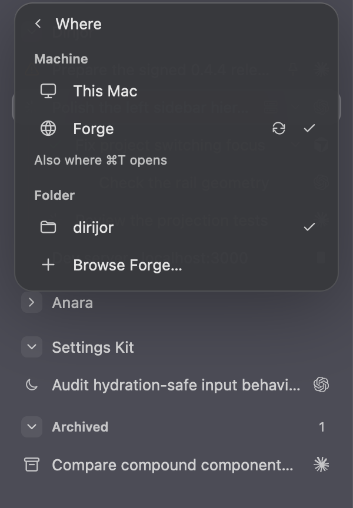 | 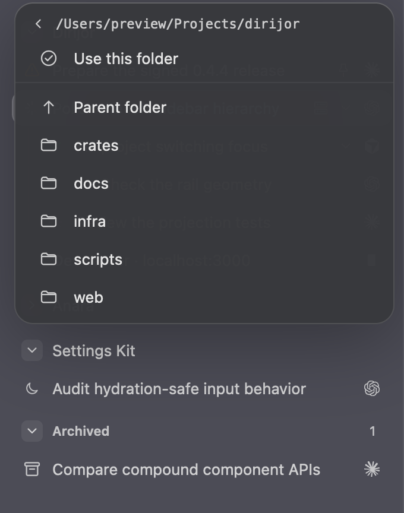 |

| Folder browser, before |
| --- |
| 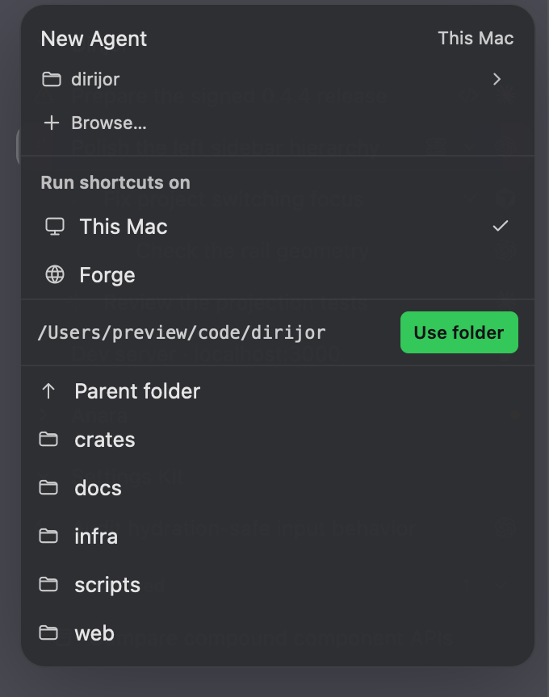 |

| Light before | Light after |
| --- | --- |
| 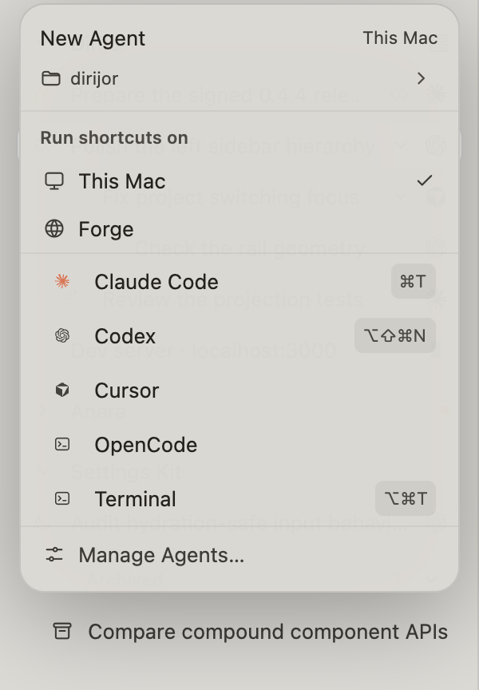 | 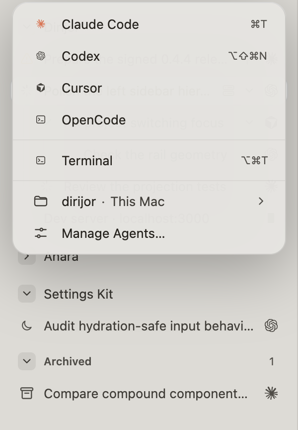 |
