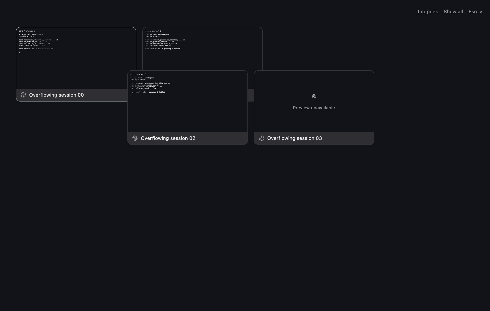
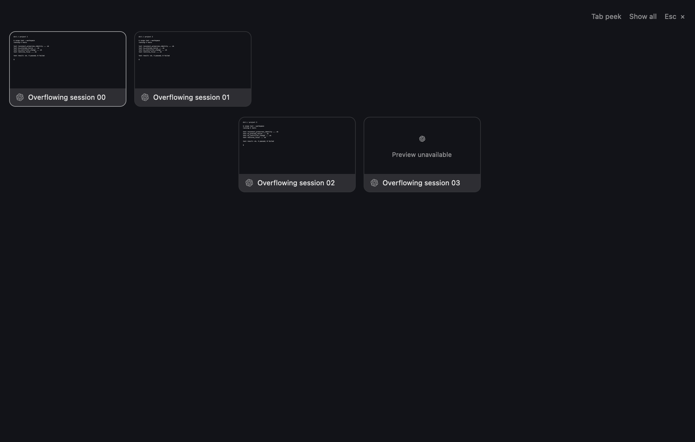

# Pinch preview continuity

Headless renders at gesture distance 220, using the same four-card fixture.
The earlier straight-line transition lets cards overlap and obscure labels;
the revised transition separates rows before expanding the cards.

| Before | After |
| --- | --- |
|  |  |

Generated with `session_surfaces::tests::render_tab_peek_screenshot`,
`DIRI_PEEK_DISTANCE=220`, and `DIRI_VISUAL_OUTPUT` set to each output path.
These captures were made before rebasing onto current main. They verify an
intermediate layout, not physical trackpad feel.
