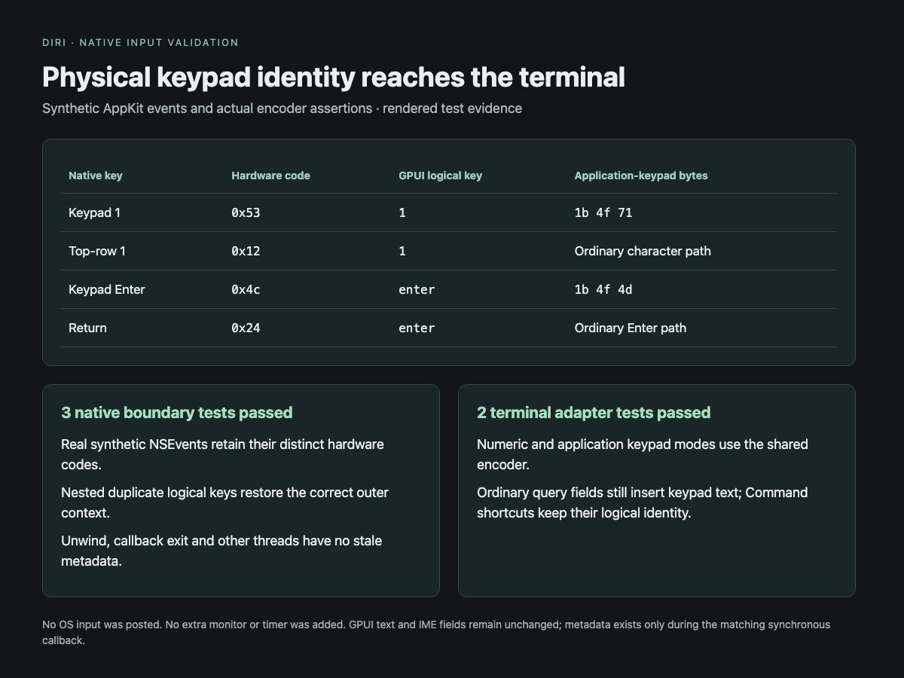

# Terminal key input

`session.send_key` and `dirijor session key` send one typed key through the existing Engine input path. The desktop and Engine use the same pure encoder in `diri-proto::terminal_input`.

```sh
dirijor session key SESSION_ID enter
dirijor session key SESSION_ID c --ctrl
dirijor session key SESSION_ID up --shift --ctrl
dirijor session key SESSION_ID f5 --shift --alt --json
dirijor session key SESSION_ID keypad:1
```

The CLI performs one key RPC after verifying the Rust Engine Hello. Named keys include arrows, Home/End, PageUp/PageDown, Insert/Delete, Enter, Tab, Escape, Backspace and F1–F12. Keypad keys are explicit: `keypad:0` through `keypad:9`, `decimal`, `divide`, `multiply`, `subtract`, `add`, `equal`, `separator`, and `enter`. Use `--repeat` for a repeated press. Literal character keys accept one printable Unicode scalar; Shift uppercases ASCII letters and leaves explicitly supplied punctuation literal.

The typed request is:

```json
{"sessionID":"example","key":{"named":"arrow-up"},"modifiers":{"ctrl":true},"action":"press"}
```

`key` has `named`, `character`, or `keypad` identity. Modifiers default to false and action defaults to `press`. The result's `bytesAccepted` reports admission into the existing input path, including its existing bounded remote queue; it is not a child delivery acknowledgement. No input is replayed after transport uncertainty.

Enter emits carriage return. It does not use paste framing even when bracketed paste is enabled. `session.send_text` remains the text/paste operation. Release events, application-owned Command shortcuts, and modified application-keypad chords return explicit unsupported errors under the current legacy keyboard encoding. Ordinary modified navigation/function keys retain the existing xterm-style encoding. See the primary [xterm control-sequence reference](https://invisible-island.net/xterm/ctlseqs/ctlseqs.html).

## Authoritative modes

The shared parser exposes DEC application cursor and keypad modes. Home and End follow application cursor mode along with arrows. Engine publication captures the grid and keyboard modes under the same existing terminal/mirror lock. The local `Modes` frame keeps its historical first byte and adds an optional versioned keyboard-state tail; absence means unknown.

Remote protocol minor 9 advertises `terminal-input-modes-v1`. The Holder encodes a sequenced `InputModes` message and its matching grid as one queue transaction before applying the existing overflow/reseed policy. The Engine stages one bounded mode record and commits it only after validating the matching snapshot/delta. Transport loss, terminal failure, exit, and a new Hello clear staged/known mode state immediately; the retained image remains available. Mode-only output is published even when no cell changes. Older peers receive no unnegotiated messages; an old Holder leaves mode-dependent input explicitly unavailable.

Local held-session checkpoints have an optional versioned `keyboardState` field. Known state is restored through the existing shared parser; historical checkpoints and truncated replay without a full baseline leave it unknown. New checkpoints preserve that distinction. There is no new terminal parser, polling timer, Holder attachment, or controller.

## Desktop boundary

The desktop consumes the observed modes and reports unavailable mode-dependent input inline. This corrects the previous unconditional default-mode encoding. The patched GPUI macOS adapter provides callback-scoped hardware identity without changing logical text or shortcuts. The terminal uses it to distinguish physical numeric-keypad keys from the top row and Return, then invokes the same encoder as the CLI. Saved or synthetic GPUI events outside native dispatch do not inherit hardware identity.

## Validation

Deterministic tests cover raw PTY bytes, Enter versus bracketed paste, modified navigation/function keys, unsupported actions, missing/closed sessions, historical local mode frames, checkpoint adoption, transactional mode/grid encoding, and mode transitions across real Helper detach/adoption using fake SSH. Default tests do not contact a developer's SSH host.

Final local validation: 1,676 workspace tests passed, 36 ignored; all 15 vendored platform tests passed. Workspace formatting, strict Clippy and release build passed. Native fixtures cover synthetic AppKit key events, duplicate logical keys with different hardware codes, nested/unwind/thread cleanup, exact encoder bytes and ordinary query-field insertion.


