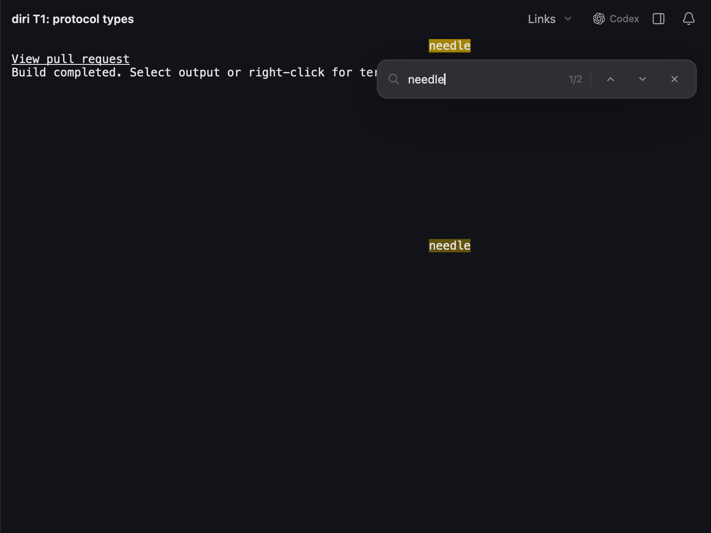
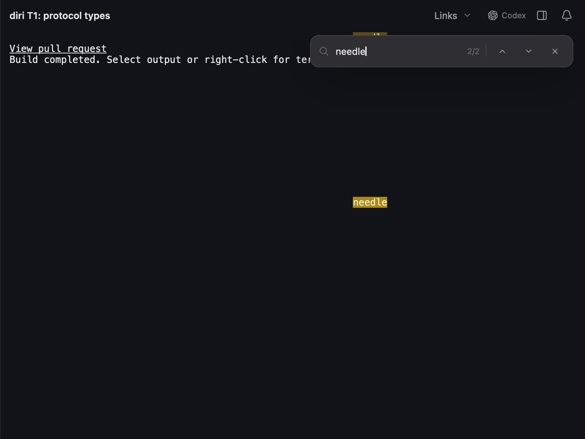
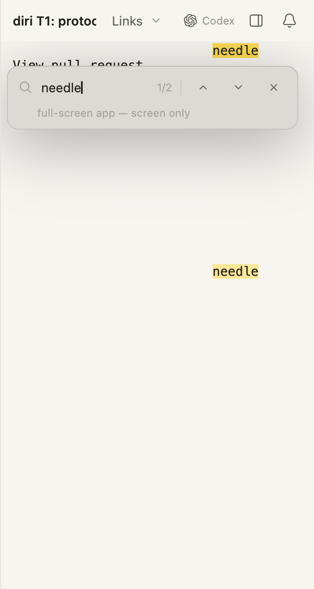

# Find overlay verification

The bar uses the active highlight's window coordinates from the terminal's current
prepaint. It measures its own content, stays at the top right when clear, and
moves below the active match when they overlap. Short panes can place it above
the match or at the left. If no placement fits, it keeps the controls at their
normal anchor. Inactive matches do not move the bar.

The overlay is outside terminal layout and makes no Engine/PTY geometry requests.
Placement is immediate and deterministic, including with reduced motion. Animated
travel and pointer-hover relocation deferral are not part of this change.

## Native renderer captures

These use the existing isolated headless GPUI fixture, not a live user session.

| Active match at top | Active match lower down |
|---|---|
|  |  |



Regenerate from `diri/` (macOS):

```sh
DIRI_QOL_SCENE=find DIRI_QOL_SCREENSHOT=/tmp/find-top.png \
  cargo test -p diri-app render_terminal_qol_screenshot -- --ignored
DIRI_QOL_SCENE=find-clear DIRI_QOL_SCREENSHOT=/tmp/find-lower.png \
  cargo test -p diri-app render_terminal_qol_screenshot -- --ignored
DIRI_QOL_SCENE=find-alt DIRI_QOL_THEME=dirijor-light DIRI_QOL_WIDTH=320 \
  DIRI_QOL_SCREENSHOT=/tmp/find-narrow.png \
  cargo test -p diri-app render_terminal_qol_screenshot -- --ignored
```

## Automated gates

- The rendered pane test checks same-frame avoidance, restored placement, close
  button hit testing, cleared highlights, unchanged terminal bounds and grid size.
- Placement cases cover translated pane origins, tall controls, narrow/short
  viewports, offscreen matches, and impossible-fit stability.
- Backward navigation with three results now wraps first → last correctly.
- Existing stale-query, content invalidation, debounce, history and alternate-screen
  search tests remain in the workspace suite.
