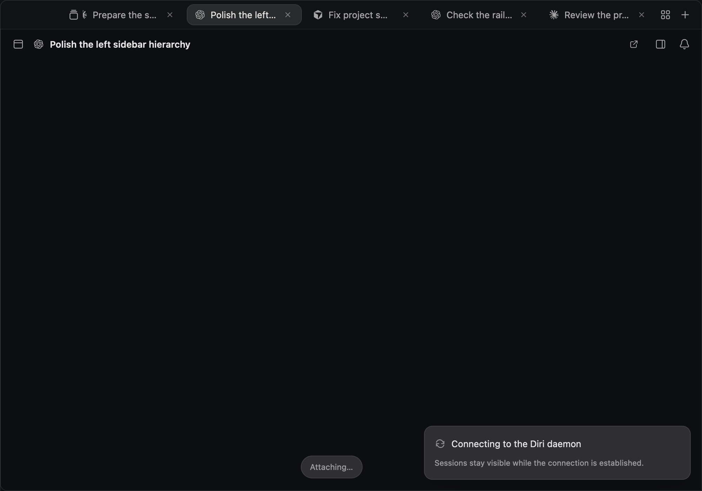

# Tab orientation layout verification

`Cmd+Shift+S` now commits the sidebar, top bar and terminal viewport in the same frame. Ordinary sidebar show/hide keeps its existing animation.

The GPUI regression test starts with a visible vertical sidebar and a saved workspace, then switches both ways repeatedly at 640, 1000 and 1942 points, with normal and reduced motion. It checks the first rendered frame without a resize or terminal-output update, including terminal identity and the macOS window-control inset.

Before the fix, the test measured a terminal right edge at 1248 points in a 1000-point window. After the fix it matches the card at 1000 points. The originally reported gap persisting until a window resize was not reproduced reliably; this change removes the observed intermediate geometry mismatch.

```sh
cargo test -p diri-app --bin diri horizontal_tabs_fill_window_on_orientation_switch
DIRI_TABS_SCREENSHOTS=/tmp/diri-tab-orientation cargo test -p diri-app --bin diri render_tab_orientation_screenshots -- --ignored
```

The native macOS screenshot below is captured immediately after switching from a visible vertical sidebar, with reduced motion disabled. It uses inert preview sessions, so the attaching and daemon-connection notices are expected. Dark, light and narrow variants were inspected.


