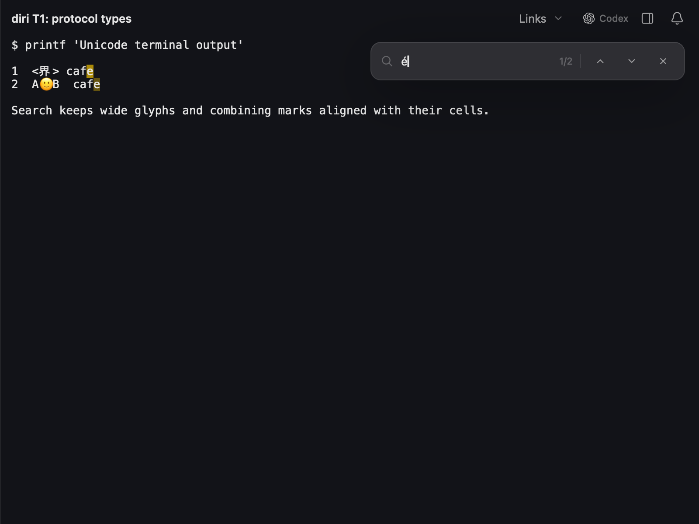

# Combining-glyph rendering verification

The terminal parser already retained combining marks, but row shaping omitted
them. Changed live rows now carry their combining text into shaping, history
borrows it from the existing viewport, and cursor glyphs include the same suffix.
Live and history cache keys include combining text so an accent-only update
cannot reuse an obsolete shape. Invisible cells keep their marks hidden.

## Native capture

The same synthetic parser-backed fixture before and after the correction:

| Before | After |
|---|---|
|  |  |

Regenerate from `diri/` on macOS:

```sh
DIRI_QOL_SCENE=find-unicode DIRI_QOL_SCREENSHOT=/tmp/unicode-rendering.png \
  cargo test -p diri-app render_terminal_qol_screenshot -- --ignored
```

## Tests and performance

109 renderer tests pass, including parser-to-shaping text, hidden marks,
accent-only damage and history cache invalidation. Strict renderer Clippy and
the native capture pass.

The existing `terminal_renderer` benchmark passed its 90% shape-reuse and 8 ms
average renderer-CPU gates. On Apple M4 Max, macOS 27, Rust 1.97.1, optimized
build, 1 s warmup and 10 samples over a requested 2 s measurement:

- 4,577 window draws: p50 0.746 ms, p90 0.803 ms, p99 2.065 ms, maximum 22.381 ms.
- Last 461-frame batch: renderer CPU average 572.373 µs; 22,540/23,050 shape hits.
- Criterion interval: 806.87 µs–1.0504 ms per benchmark iteration.

Other compilation was active. This checks the existing local safety gates;
it is not a before/after speedup, input-latency measurement, or comparison with
another application. The slowest frames still warrant full-app pacing checks.

```sh
cargo bench -p diri-term --bench terminal_renderer -- \
  --warm-up-time 1 --measurement-time 2 --sample-size 10 --noplot
```
