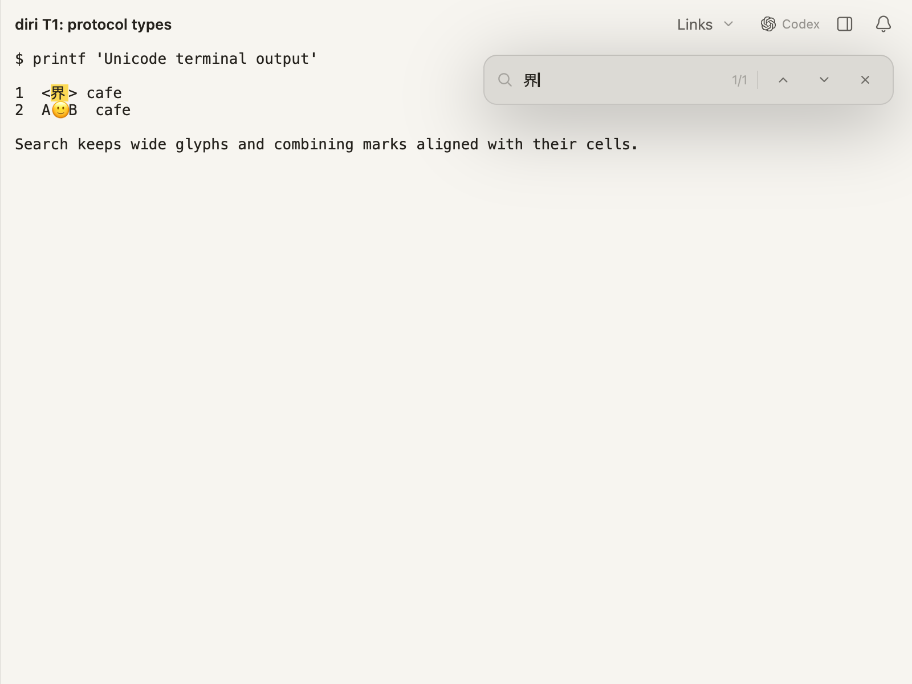

# Unicode search verification

Native GPUI captures use synthetic terminal output passed through the shared
parser. The query `e` plus U+0301 finds both combining sequences; `界` covers its
two terminal columns. The query field, count and highlights are actual Diri UI.




These captures also expose an existing renderer gap: terminal glyph painting
omits combining accents even though the parser, text export and search retain
them. Glyph painting and its cache invalidation need a separate correction.

Regenerate on macOS from `diri/`:

```sh
DIRI_QOL_SCENE=find-unicode DIRI_QOL_SCREENSHOT=/tmp/combining-search.png \
  cargo test -p diri-app render_terminal_qol_screenshot -- --ignored
DIRI_QOL_SCENE=find-unicode DIRI_QOL_QUERY=界 DIRI_QOL_THEME=dirijor-light \
  DIRI_QOL_SCREENSHOT=/tmp/wide-search.png \
  cargo test -p diri-app render_terminal_qol_screenshot -- --ignored
```

Parser-to-search tests verify live and history cell ranges for whole combining
sequences, base characters, isolated combining marks, and wide characters.
Protocol tests check omission for ordinary text and older-response decoding.
