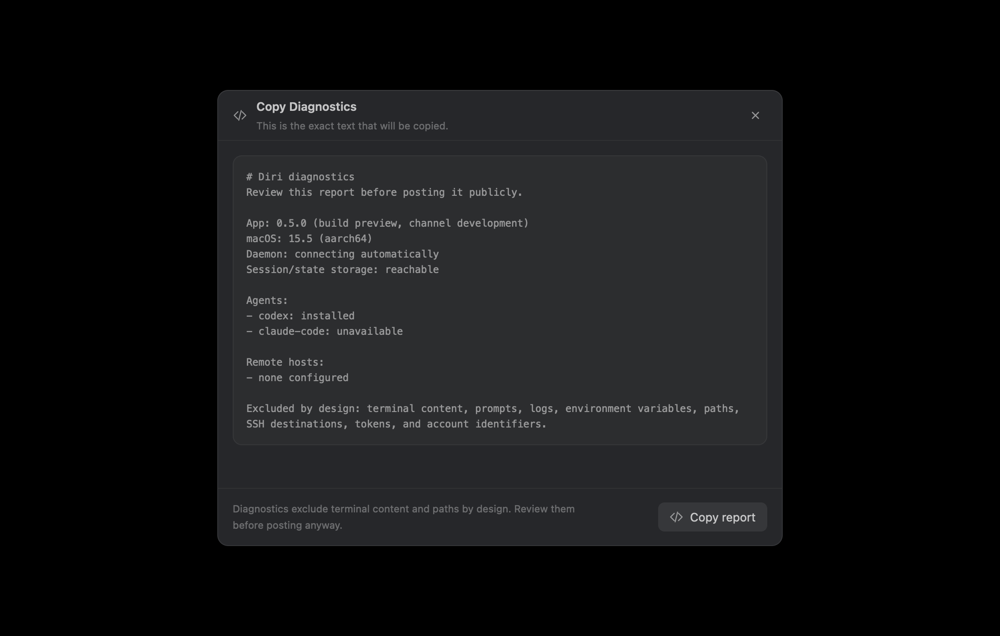

# Status, diagnostics, and motion verification

This checklist records the manual UI coverage for the shared surfaces changed
by issues #41, #42, #44, and #46.

## Privacy-safe diagnostics

Launch the exact report surface directly for review or screenshots:

```sh
./scripts/dev.sh --settings diagnostics
```

Regenerate the checked-in, inert-data screenshot without Screen Recording
permission:

```sh
DIRI_VISUAL_OUTPUT="$PWD/../docs/images/status-diagnostics.png" cargo test -p diri-app render_diagnostics_preview_screenshot -- --ignored --test-threads=1
```



1. Open **Settings → General → Support → Copy diagnostics**.
2. Confirm the preview is the exact clipboard payload and tells the user to
   review it before posting.
3. Confirm no session title, terminal content, prompt, log, environment value,
   filesystem/repository path, SSH destination, token, or account id appears.
4. Copy the report and compare the clipboard text with the preview.

## Recovery state gallery

Verify connecting, automatic reconnect, manual-attention, failed action,
retrying action, and recovered states. Existing session rows and terminal grids
must remain visible; the notice must not move keyboard focus. Confirm that only
Rename and Sync Preferences failures offer a replay action. Spawn, resume,
archive, close, migrate, restore, and reopen failures must never replay
automatically.

## Status decision evidence

Open **Session Inspector → Info → Why Diri thinks this** for hook-led,
screen-led, process-only, stale/unknown, and older no-evidence records. Confirm
that screen-driven agents show a matched rule id, contradictory evidence is
ignored, and **Copy status debug info** contains no terminal or path data.

## Reduce Motion inventory

With macOS **Reduce motion** both off and on, rapidly open, close, and reopen:

- Command Palette and Quick Open
- launcher machine/folder pickers
- Settings, including Copy Diagnostics
- worktrees
- close confirmation
- Session Inspector tabs

Normal motion retains the 160 ms floating-surface fade and 190 ms inspector-tab
transition. Reduced Motion makes both immediate. The repeating loading spinner
is essential progress feedback; GPUI freezes repeating animations under Reduce
Motion while leaving the indicator visible. Sidebar and inspector seam travel
already use `cx.reduce_motion()` and remain immediate in reduced mode.
